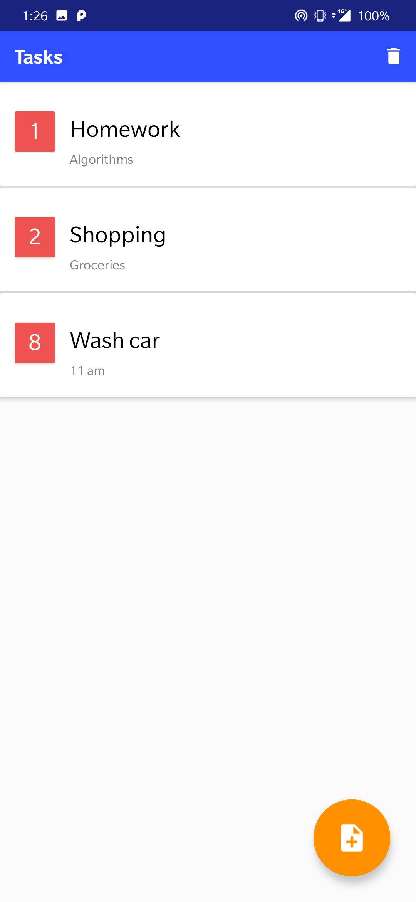
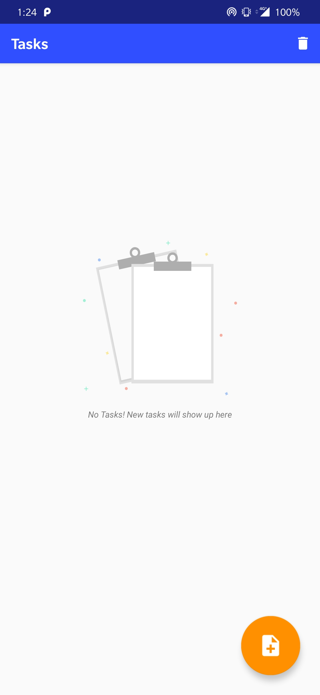
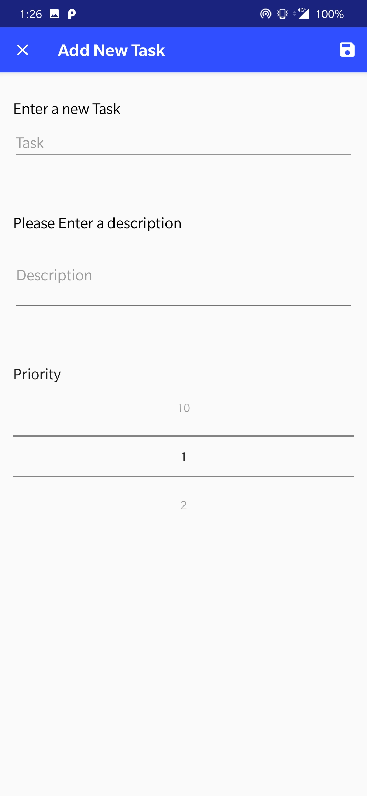

# TasksApp
A simple tasks app made using the MVVM(Model-View-ViewModel) Architecture. Room Architecture Component is used for Database.
best app to schedule your time

## Task list 

The RecylerView contains an empty view. If items in RecyclerView = 0 (getItemCount()==0) then the empty view will be displayed else the view with the layout for the item will be displayed.
The items are then arranged in order of the priority. Priority can be set from 1-10

## EmptyView for RecyclerView

This is the empty view for the RecyclerView

## Add Task Activity

Add new task activity. The EditText for task, description and the Priority value are passed as LiveData from taskViewModel.
